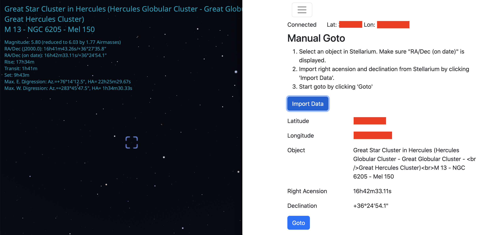

# Dwarf II Stellarium Goto

This website connects to the Dwarf II telescope to Stellarium via the [Dwarf II API](https://hj433clxpv.feishu.cn/docx/MiRidJmKOobM2SxZRVGcPCVknQg) and Stellarium remote control plugin. Once Dwarf II and Stellarium are connected, you can select an object in Stellarium, and then tell Dwarf II to go to that object.

 –

## Setup for coders

If you are interested in seeing how the code works or contributing to the project, then follow these steps.

This app is built with Next.js, Typescript, and Bootstrap css. This app uses eslint and Prettier to lint and format the code.

1. Clone this repo.

2. Install libraries.

```bash
npm install
```

3. Start server.

```bash
npm run dev
```

## Setup for non-coders

If you just want to get the site up and running on your machine, then follow these steps.

1. Download the file [DwarfStellariumGoto.tar.gz](https://github.com/DwarfTelescopeUsers/dwarfii-stellarium-goto/releases/tag/v0.1.0-alpha).

2. Unzip the file. A DwarfStellariumGoto directory will be created.

3. Start a server inside the DwarfStellariumGoto directory. I recommend using Python's webserver.

```bash
cd DwarfStellariumGoto
python -m http.server
```

4. Visit the site in a browser. If you use the Python server, visit [localhost:8000](http://localhost:8000/)
